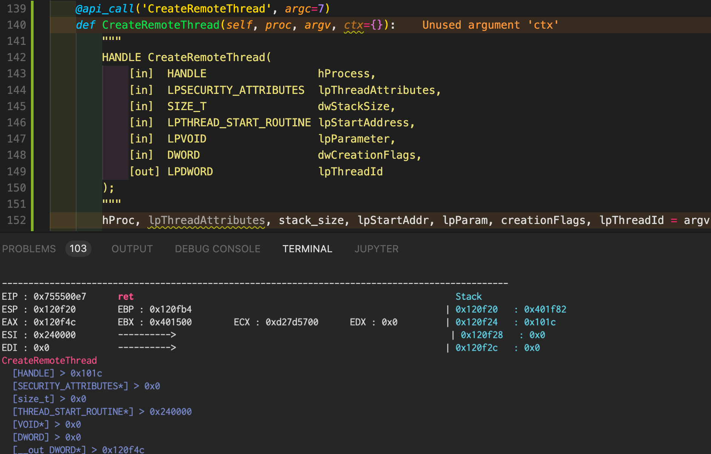
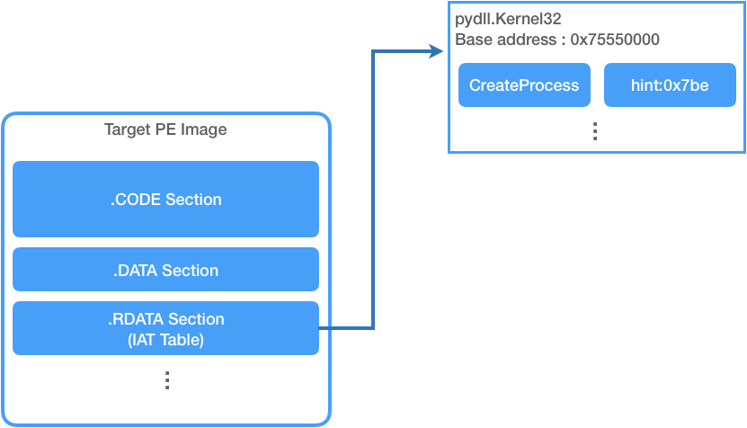
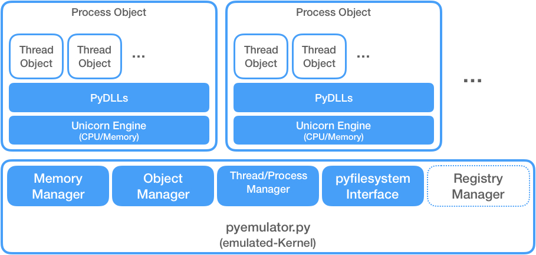

### python based windows x86 malware emulator

</br>
</br>

## Main Idea

### - Main Idea
The core functions of Windows Executables are done by WINAPI. The WINAPI are implemented in system dlls such as kernel32.dll, ntdll.dll which Windows Executables would load. In compile time, WINAPI was written at IAT(Import Address Table) of Windows Executable. Therefore, in general case, if we want to hook specific WINAPI, we can be possible by modifying the address of WINAPI recoreded in IAT.

This is the main idea of __**pyWinx86emulator**__. By overwritting IAT of target PE Image and use [UC_HOOK_CODE (or UC_HOOK_MEM_READ)](https://github.com/unicorn-engine/unicorn/blob/master/bindings/python/sample_x86.py),__**pyWinx86emulator**__ can change the process flow to python-based emulated dll.
</br>

To make possible to run Windows Executable with no critical error based on this idea, we have to implement emulated Windows Subsystem or Managers before.
Next is the architecture which makes possible above requirment.

### - Architecture
__**pyWinx86emulator**__ is developed using [Unicorn Engine](https://www.unicorn-engine.org/). It is a framework of CPU emulator which is very simple to use. With this framework, __**pyWinx86emulator**__ is constructed with 5 parts.
1. emulated dlls
2. pyfilesystem interface
3. emulated managers
4. kernel (pyemulator.py)
5. [TODO] emulated registry subsystem

Here is the architecture of __**pyWinx86emulator**__.

</br>


## Development
### - Implemented
In v0.1b, I just implemented 57 emulated WINAPI and not implemented emulated Registry Subsystem. I think this may not enough to launch general malwares.
### - Customize
You can simply add your customized/emulated WINAPI in pydlls by following below format.
```
@api_call('<WINAPI_NAME>', argc=<API_ARGUMENT_NUMBERS>, conv=cv.CALL_CONV_CDECL)
def <WINAPI_NAME>(self, proc, argv, ctx={}):
    """
    void _exit(
        int const status
    );
    """
    arg1, arg2, arg3, ... = argv
    self.exit(proc, argv, ctx)
    return 0
```

## Installation and Launch
### - Installation
Suggested environment is Python 3.5 ^.
```
git clone https://github.com/orca-eaa5a/winx86emulator.git
pip install -r requirements.txt
```
### - Launch
Check __test.py__
```
emu_handler = e_handler.EmuHandler()
full_path = os.path.abspath(os.path.join(__file__, os.path.pardir, target_file))
emu = emu_handler.create_new_emulator(full_path)
emu.launch()
```

## License

This software is licensed under the [MIT](https://github.com/nhn/tui.editor/blob/master/LICENSE) © orca.eaa5a